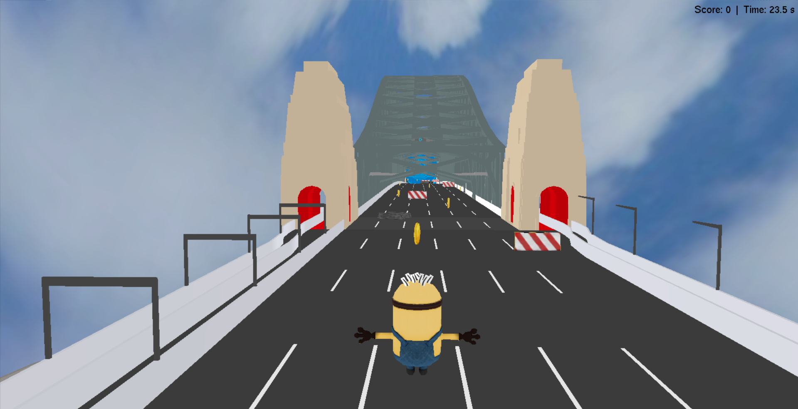
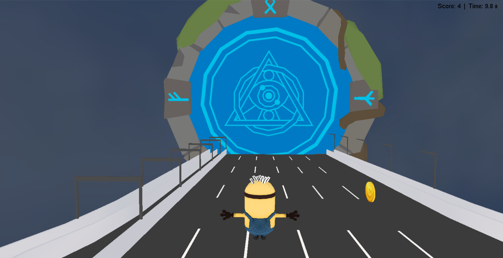
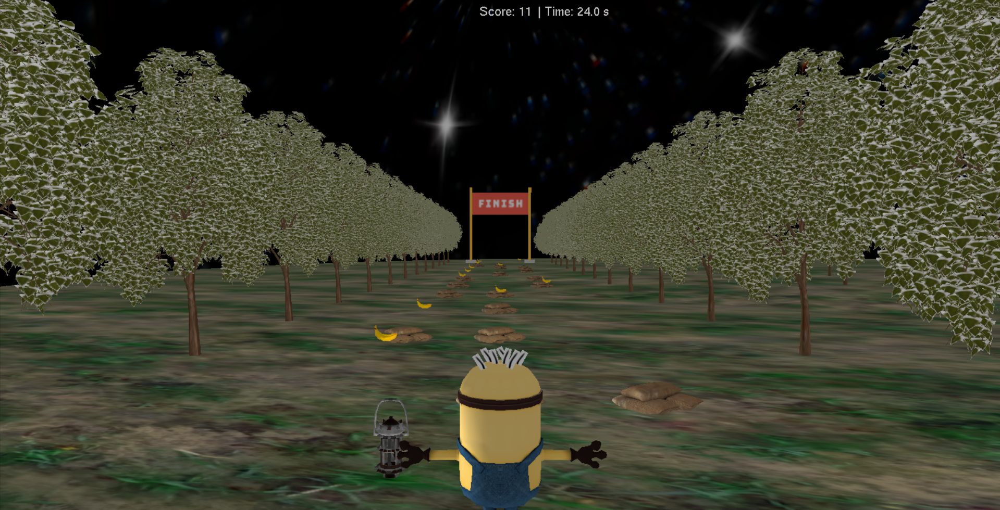

# Minion Mania Game 🎮  

A 3D game inspired by Minion Rush, developed using **OpenGL in C** as part of the **DMET502 Computer Graphics, Winter 2024** course at the **German University in Cairo**. Guide your minion through exciting environments, collect rewards, and overcome challenges in this immersive game experience!

---

## 📖 Game Overview  

**Minion Mania** features a yellow minion navigating two unique levels:  
1. **Level 1**: A bright cityscape during the day.  
2. **Level 2**: A mystical forest at night.  

The game offers:  
- Collectibles like **coins** and **bananas**.  
- Challenging obstacles such as **fallen logs**, ***barriers** and **sandbags**.  
- Dynamic lighting transitions between day and night.  
- Two camera modes: **first-person** and **third-person** views.  
- Interactive gameplay with real-time animations, sounds, and a score display.

---

## 🚀 Features  

### 1. **Game Mechanics**  
- Navigate using **keyboard** for movement and **mouse** for switching camera views.  
- Collect coins and bananas to progress and unlock levels.  
- Avoid obstacles like fallen logs and sandbags.  

### 2. **Levels and Targets**  
- **Level 1**: Collect enough coins to activate a **magical portal** that transports the player to Level 2.  
- **Level 2**: Navigate the dark forest to reach the **finish line** and complete the game.

### 3. **Camera Modes**  
- **First-Person View**: The camera acts as the player’s eye for immersive gameplay.  
- **Third-Person View**: The camera follows behind and slightly above the minion.  

### 4. **Real-Time Animations**  
- Coins and bananas rotate and float for a realistic effect.  
- Sound effects play for actions like collecting items or colliding with obstacles.  
- Collisions trigger a rebound effect using translation transformations.

### 5. **Dynamic Lighting**  
- Bright sunlight illuminates the cityscape in Level 1.  
- A dimmed light and a **flashlight/lantern** guide the player in the forest at night.  

---

## 📷 Screenshots




---

## 🎮 Controls  

| Action            | Control          |  
|-------------------|------------------|  
| Move and Jump     | Keyboard arrows  |   
| Switch Camera     | Mouse Click or 'f'/'t' on the Keyboard|  

---

## 📦 Installation  

1. Clone this repository:  
   ```bash  
   git clone https://github.com/your-username/minion-mania.git
2. Open the project in your preferred IDE (e.g., Visual Studio).
3. Compile the game using your OpenGL setup.
4. Run the game executable.
